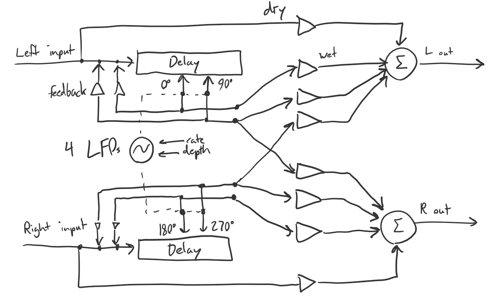

# Glorious

A stereo chorus plugin made with [JUCE](https://juce.com/)

### What is this?

Glorious is a [chorus](https://en.wikipedia.org/wiki/Chorus_(audio_effect)#Electronic_effect) effect plugin. It takes in an audio signal, duplicates it, slightly changing the pitch of the duplicates, and outputs the signal and duplicates. The result is the impression multiple "voices" instead of one, like a group of violinists playing the same melody.

### Background

I originally created the first algorithm for this chorus in high school in the [Audulus](https://audulus.com/) modular synthesis/visual programming environment. Later I implemented it in [csound](https://csound.com/). I decided implementing the algorithm "for real" in JUCE would be a great way learn C++ and the JUCE framework. 

### How does it work?

Glorious:

This mode employs the use of two delay lines, with two taps taken from each. There are four sine wave LFOs modulating the delay time for all 4 taps, which are phase shifted by 90 degrees apart from each other. The outputs from the delay taps are then mixed down in such a way as to be evenly panned around the listener.

The result is a flexible and generally "swirly" sounding chorus (especially if the "Mod"/feedback control is turned up) which can go from subtle to quite crazy. 

June:

This mode is modeled after the famous chorus circuit on the Roland Juno 6/60/106 series of polysynths. Because it was a budget product, Roland had to come up with clever ways to make the single oscillator per voice sound lush. The result was a chorus unit using inverted triangle LFOs to modulate a pair of delay lines with carefully selected rate and density settings. As the chorus has only two buttons ("I" and "II") and Glorious has 4 knobs, it was rather limited in comparison. However, the settings were well chosen, so I've made dialing in those parameters on Glorious easy. To emulate chorus I, set mix to 50%, rate to 0.4-0.5 Hz, depth to 50%, and mod to 0%. For chorus II, simply set the rate to 0.8-1.0 Hz. On the old Junos, one also had the option to engage both choruses, which thickened the sound. Due to hardware limitations, this did not actually run I and II in parallel, but because I'm lazy I've decided to implement this feature a different way. Turning up the "Mod" control will bring in a second copy of the chorus at a slightly faster modulation rate compared to the current setting (the same ratio as I and II), thus giving one two choruses in parallel.

### How do I install it?
